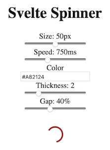

[![npm][npm]][npm-url]

[npm]: https://img.shields.io/npm/v/svelte-spinner.svg
[npm-url]: https://npmjs.com/package/svelte-spinner


A Svelte SVG loading spinner.

This repo shows how to develop, test and export a Svelte component.


## Requirements

- npm

## Getting started

```
$ npm install --save
```

### Trying the component

```
$ cd example
$ npm install --save      # may give a lot of warnings (about `fsevent`)
$ npm start

rollup v1.27.4
bundles main.js → dist/bundle.js...
http://localhost:10001 -> <..8<..>/example/dist
LiveReload enabled
created dist/bundle.js in 536ms

[2019-11-24 11:54:18] waiting for changes...
```

Observe the port mentioned and try out at [http://localhost:10001](http://localhost:10001).

>


## Developing


## Usage

```
<!-- App.svelte -->
<script>
  import Spinner from 'svelte-spinner';
</script>

<Spinner
  size="50"
  speed="750"
  color="#A82124"
  thickness="2"
  gap="40"
/>
```

### Spinner API
 
| Properties | Default Value | Description
|---|---|---
| `size`      | `25`  | The height and width of the SVG spinner.
| `speed`     | `750` | How many milliseconds it will take for the spinner to complete one rotation.
| `color`     | `'rgba(0,0,0,0.4)'` | The color of the spinner.
| `thickness` | `2`   | The thickness of the spinner.
| `gap`       | `40`  | How many percent of the spinner that will not be filled.


## References

- [EmilTholin/svelte-spinner](https://github.com/EmilTholin/svelte-spinner)

	The basis.
	
	Differences to the base repo:
	- using just one `package.json` instead of two. This less strict separation of `example` from the source allows us to do testing.

